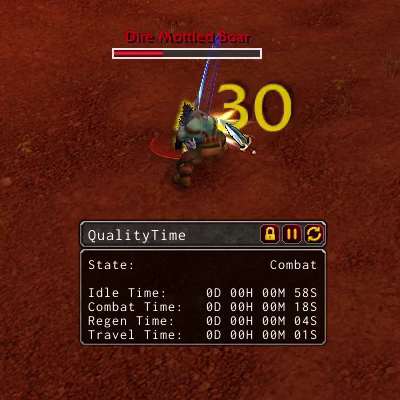

# QualityTimeAddon
QualityTime is an addon that keeps track of how you spend your time in the World of Warcraft. 
There are four different states your character can be in, combat, regenerating, traveling, and idle. 
Your state changes based on what you're doing at that time. 
The amount of time you spend in a state is displayed in a movable, lockable frame and can be paused and reset when desired.

## Installation
### Download
1. Click the download button on the repository's Github page, then select Download ZIP.
2. Wait for the zip file to download
3. Unzip the file into Interface\Addons.
4. It should look like Interface\Addons\QualityTime\QualityTime.lua
### Git Clone
1. Clone the repository into Interface\Addons.
2. It should look like Interface\Addons\QualityTime\QualityTime.lua
